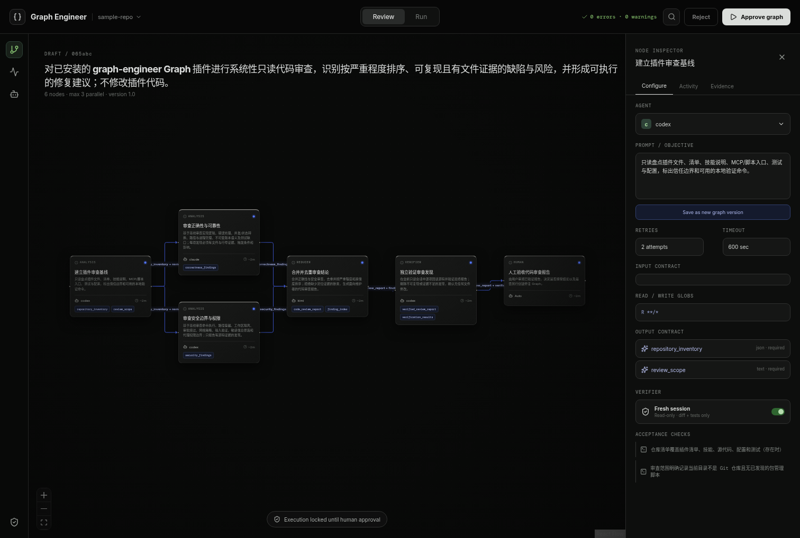
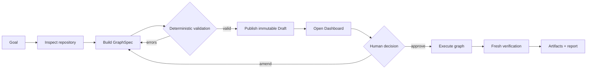

<div align="center">

# Graph Engineer

### Turn one coding goal into a validated, reviewable execution graph.

**Install once. Invoke Graph. Review the Draft. Approve when you are ready.**

[](https://learn.chatgpt.com/docs/plugins)
[](https://code.claude.com/docs/en/plugins)
[](https://www.typescriptlang.org/)
[](#safety-by-construction)

</div>



Graph Engineer packages a deterministic graph compiler, an approval-gated runtime, and a live Dashboard into one installable **Graph** plugin for Codex and Claude Code. The host model plans; deterministic code validates; you remain the approval boundary.

```text
install → $graph <goal> → validated Draft → Dashboard review → human approval → execution
```

## Why Graph?

Coding agents are excellent workers, but complex tasks still need explicit dependencies, isolated write scopes, bounded retries, fresh verification, and a human-readable plan. Graph turns those requirements into a versioned `GraphSpecV1` before any work begins.

| Without Graph | With Graph |
| --- | --- |
| A long prompt hides sequencing assumptions | Dependencies are visible edges |
| Parallel agents can collide | Writers use isolated Git worktrees |
| Verification may share worker context | Verifiers use fresh read-only sessions |
| Retries can loop indefinitely | Attempts and runtime are bounded |
| Execution begins before the plan is clear | Every graph starts as a human-reviewed Draft |
| Progress is scattered across terminals | Events, diffs, tests, and artifacts stream into one Dashboard |

## Install in 30 seconds

### Codex

```bash
codex plugin marketplace add wuzihuang/graph-engineer
codex plugin add graph@graph-engineer
```

Start a new Codex session, then run:

```text
$graph implement the billing settings page
```

You can also choose **Graph** from the Codex plugin picker with `@Graph`.

### Claude Code

```bash
claude plugin marketplace add wuzihuang/graph-engineer
claude plugin install graph@graph-engineer --scope user
```

Start a new Claude Code session, then run:

```text
/graph:graph implement the billing settings page
```

If you clone the repository and use `./install-graph claude`, Graph also installs the shorter `/graph` alias.

### Local installer

```bash
git clone https://github.com/wuzihuang/graph-engineer.git
cd graph-engineer
./install-graph codex   # or: claude / all
```

Requirements: **Node.js 20+** and **Git**. The first invocation installs the local SQLite runtime dependency.

## What happens when you invoke Graph



The plugin deliberately stops after opening the Draft. Planner-facing MCP tools cannot approve or execute a graph.

## Dashboard

The Dashboard provides two focused modes:

- **Review** — inspect nodes, dependencies, prompts, agents, read/write scopes, retry budgets, timeouts, inputs, outputs, and acceptance checks.
- **Run** — follow normalized activity, tool calls, terminal output, diffs, tests, artifacts, retries, and reconnect-safe event replay.

Draft edits create a new immutable graph version. Running versions are never modified in place.

## Safety by construction

- Human approval is required for every graph version.
- The daemon binds only to `127.0.0.1` and protects APIs with a mode-`0600` session token.
- Parallel writers receive separate Git worktrees.
- Changed paths are checked against declared `writeGlobs`.
- Code-writing nodes require fresh, read-only verification.
- Retry count, graph depth, parallelism, and total runtime are bounded.
- Network access, publishing, deployment, deletion, payment, and other irreversible operations remain approval-gated.
- Agent credentials are never persisted; common secret shapes are redacted.
- Nested worker subagents are disabled by default.

Read the full [security and threat model](docs/security.md).

## Architecture

```text
Codex / Claude Code
       │  $graph / /graph:graph
       ▼
Planner-safe MCP tools
       │  inspect · validate · publish Draft · status · amend
       ▼
Graph compiler ──► immutable GraphSpec versions
       │
       ▼ human approval
Graph runtime ──► isolated workers ──► fresh verifiers
       │
       ├── SQLite WAL event store
       ├── Git worktrees and artifacts
       └── WebSocket activity stream ──► Dashboard
```

| Package | Responsibility |
| --- | --- |
| `apps/daemon` | Local Fastify API, WebSocket stream, auth, and recovery |
| `apps/web` | React/Vite review and run Dashboard |
| `apps/cli` | `graphctl` command surface |
| `packages/contracts` | GraphSpec, event, task, and verification contracts |
| `packages/graph-compiler` | Deterministic validation and compilation |
| `packages/graph-runtime` | Scheduling, retries, cancellation, and recovery |
| `packages/event-store` | SQLite WAL persistence and monotonic events |
| `packages/worktree-manager` | Writer isolation, scope checks, diffs, and integration |
| `packages/plugin-mcp` | Planner-safe MCP server bundled with the plugin |

See the [architecture guide](docs/architecture.md) for trust boundaries and persistence details.

## Local development

The repository uses pnpm 10. If pnpm is not installed globally, replace `pnpm` with `npx pnpm@10.15.0`.

```bash
pnpm install
pnpm build
pnpm --filter @graph-engineer/daemon dev
```

For frontend hot reload:

```bash
pnpm --filter @graph-engineer/web dev
```

The daemon runs on `http://127.0.0.1:4317`; Vite runs on `http://127.0.0.1:4318` and proxies API and WebSocket traffic.

### Run the complete local demo

```bash
pnpm graphctl demo
```

Review the generated Draft in Dashboard and approve it there. For an automated acceptance pass that still crosses the explicit CLI approval boundary:

```bash
pnpm graphctl demo --approve --wait
```

The demo exercises analysis, parallel workers, integration, fresh verification, bounded retry, final acceptance, event replay, and artifact reporting.

### Verify the project

```bash
pnpm typecheck
pnpm lint
pnpm test          # 25 unit/integration tests
pnpm e2e           # Dashboard approval + live run + replay
pnpm plugin:build  # self-contained plugin runtime bundle
```

## Documentation

| Guide | Contents |
| --- | --- |
| [GraphSpec](docs/graph-spec.md) | Declarative graph schema and invariants |
| [Architecture](docs/architecture.md) | Components, trust boundaries, and execution sequence |
| [Agent adapters](docs/agent-adapters.md) | ACP discovery and adapter model |
| [Security](docs/security.md) | Threat model and approval boundaries |
| [Roadmap](docs/roadmap.md) | Current limitations and planned work |

## Project status

Graph Engineer is an early, working local-first implementation. The plugin, compiler, runtime, Dashboard, persistence layer, recovery path, test suite, Codex marketplace, and Claude Code marketplace are implemented. Production agent adapters beyond the included mock/demo path remain an active area of development.

---

<div align="center">

**Make the plan visible before the agents move.**

</div>
